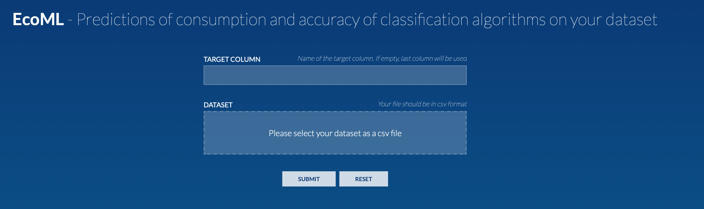

|Cirrus CI|

.. |Cirrus CI| image:: https://api.cirrus-ci.com/github/epfl-iglobalhealth/cumulator.svg
   :target: https://cirrus-ci.com/github/epfl-iglobalhealth/cumulator

=========
CUMULATOR
=========

A tool to quantify and report the carbon footprint of machine learning computations and communication in academia and healthcare

Aim
___
Raise awareness about the carbon footprint of machine learning methods and to encourage further optimization and the rationale use of AI-powered tools.
This work advocates for sustainable AI and the rational use of IT systems.

Key Carbon Indicators
_____________________
* **One hour of GPU load is equivalent to 112 gCO2eq**
* **1 GB of data traffic through a data center is equivalent to 31 gCO2eq**

Prerequisites
_______________
The tool works with Linux, Windows and MacOS

**Required Libraries**

- ``geocoder`` (https://geocoder.readthedocs.io)
- ``geopy`` (https://geopy.readthedocs.io/en/stable/)
- ``GPUtil`` (https://pypi.org/project/GPUtil/)
- ``cpuinfo`` (https://pypi.org/project/py-cpuinfo/)

To run the web app:

- ``numpy`` (https://numpy.org)
- ``pandas`` (http://pandas.pydata.org)
- ``flask`` (https://flask.palletsprojects.com/en/2.0.x/)

Install and use
_______________

Free software: MIT license

``pip install cumulator`` <- installs CUMULATOR

``from cumulator import base`` <- imports the script

``cumulator = base.Cumulator()`` <- creates an Cumulator instance 

**Measure cost of computations.** 

- First option: Activate or deactivate chronometer by using ``cumulator.on()``, ``cumulator.off()`` whenever you perform ML computations (typically within each interation). It will automatically record each time duration in ``cumulator.time_list`` and sum it in ``cumulator.cumulated_time()``. Then return carbon footprint due to all computations using ``cumulator.computation_costs()``.
- Second option: Automatically track the cost of computation of a generic function with ``cumulator.run(function, *args, **kwargs)`` and then use ``cumulator.computation_costs()`` as before. An example is reported below:

:: 

    cumulator = Cumulator()
    model = LinearRegression()
    diabetes_X, diabetes_y = datasets.load_diabetes(return_X_y=True)

    # without output and with keywords arguments
    cumulator.run(model.fit, X=diabetes_X, y=diabetes_y)

    # with output and without keywords arguments
    y = cumulator.run(model.predict, diabetes_X)

    # show results
    cumulator.computation_costs()

**Measure cost of communications.**

- Each time your models sends a data file to another node of the network, record the size of the file which is communicated (in kilo bytes) using ``cumulator.data_transferred(file_size)``. The amount of data transferred is automatically recorded in ``cumulator.file_size_list`` and accumulated in ``cumulator.cumulated_data_traffic``. Then return carbon footprint due to all communications using ``cumulator.communication_costs()``.

**Display your total carbon footprint**

- Display the carbon footprint of your recorded actions with ``cumulator.display_carbon_footprint()``:

::

    ########
    Overall carbon footprint: 1.02e-08 gCO2eq
    ########
    Carbon footprint due to computations: 1.02e-08 gCO2eq
    Carbon footprint due to communications: 0.00e+00 gCO2eq
    This carbon footprint is equivalent to 1.68e-13 incandescent lamps switched to leds.

    
- You can also return the total carbon footprint as a number using ``cumulator.total_carbon_footprint()``.

**Web-app use**

Cumulator also contains a web-app to automatically estimate the accuracy and the power consumption of 4 different algorithms (Linear Regression, Random Forest, Decision Tree, Neural Network) on the given dataset in input.

To open the web-app, run ``src/cumulator/web_app/app.py``, the web-app will then run on localhost.
Through the use of the web-app is possible to upload an input dataset and to indicate which is the target column: it will be then automatically excluded from the accuracy and the power consumption computation.

**Default assumptions: geo-localization, CPU-GPU detection (can be manually modified for better estimation):**

Cumulator will try to detect the CPU and the GPU used and set the respective computation cost value. In case the detection fails the default value will be set.
Future updates of the dataset of country consumption can be found on the official page (https://github.com/owid/energy-data?country=). It needs to be slightly modified to be used by Cumulator. An automatic script to transform the dataset is given in base_repository/country_dataset_helpers.py.
To update the hardware dataset instead, a script in base_repository/hardware/webscraper.py can be used.

``self.hardware_load = 250 / 3.6e6`` <- computation costs: power consumption of a typical GPU in Watts converted to kWh/s

``self.one_byte_model = 6.894E-8`` <- communication costs: average energy impact of traffic in a typical data centers, kWh/kB

Cumulator will try to set the carbon intensity value based on the geographical position of the user. In case the detection fails the default value will be set.
It is possible to manually modify the default value. 

``self.carbon_intensity = 447`` <- conversion to carbon footprint: average carbon intensity value in gCO2eq/kWh in the EU in 2014

``self.n_gpu = 1`` <- number of GPU used in parallel

**Prediction consumption and F1-Score on classification tasks**

- ``cumulator.predict_consumptions_f1(dataset, target)``: Cumulator offers a feature for estimating both the consupmtion and the F1-Score of different classification machine learning algorithms (i.e: Linear, Decision Tree, Random Forest, Neural Network) given the dataset that the user is using. The goal is to allow users to choose the algorithm giving the best score but with the least consumption possible.

An example is reported below:

::

    from base import Cumulator 
    from sklearn.datasets import load_iris,load_diabetes  
    import pandas as pd  
    import numpy as np  
    
    cumulator = Cumulator()
    iris = load_diabetes()
    data1 = pd.DataFrame(data= np.c_[iris['data'], iris['target']], columns= iris['feature_names'] + ['target'])
    cumulator.predict_consumptions_f1(data1, 'target')

**Important**:
The model used for prediction consumption and F1-Score has been trained on datasets with up to:

- 1000 features
-  20 classes 
- 100000 instances
- 80000 missing values.

Therefore when using this feature please check if your datasets exceeds these values.

More information about the prediction feature and the recognition of the user position and GPU/CPU at https://github.com/epfl-iglobalhealth/CS433-2021-ecoML.

Project Structure
_________________

:: 

    src/
    ├── cumulator  
        ├── base.py            <- implementation of the Cumulator class  
        ├── prediction_feature <- implementation of the prediction feature 
        ├── web_app            <- implementation of web app for the prediction feature
        └── bonus.py           <- Impact Statement Protocol  

Cite
____
Original paper:
::

    @article{cumulator,
      title={A tool to quantify and report the carbon footprint of machine learning computations and communication in academia and healthcare},
      author={Tristan Trebaol, Mary-Anne Hartley, Martin Jaggi and Hossein Shokri Ghadikolaei},
      journal={Infoscience EPFL: record 278189},
      year={2020}
    }

ChangeLog
_________
* 15.2.2022: 0.0.7 added prediction feature, web-app, geo-localization and gpu/cpu-detection estimation
* 18.06.2020: 0.0.6 update README.rst
* 11.06.2020: 0.0.5 add number of processors (0.0.4 failed)
* 08.06.2020: 0.0.3 added bonus.py carbon impact statement
* 07.06.2020: 0.0.2 added communication costs and cleaned src/
* 21.05.2020: 0.0.1 deployment on PypI and integration with Alg-E

Links
_____
* Material: https://drive.google.com/drive/u/1/folders/1Cm7XmSjXo9cdexejbLpbV0TxJkthlAGR
* GitHub: https://github.com/epfl-iglobalhealth/cumulator
* PyPI: https://pypi.org/project/cumulator/
* Prediction Feature, geo-localization, CPU/GPU detection: https://github.com/epfl-iglobalhealth/CS433-2021-ecoML
